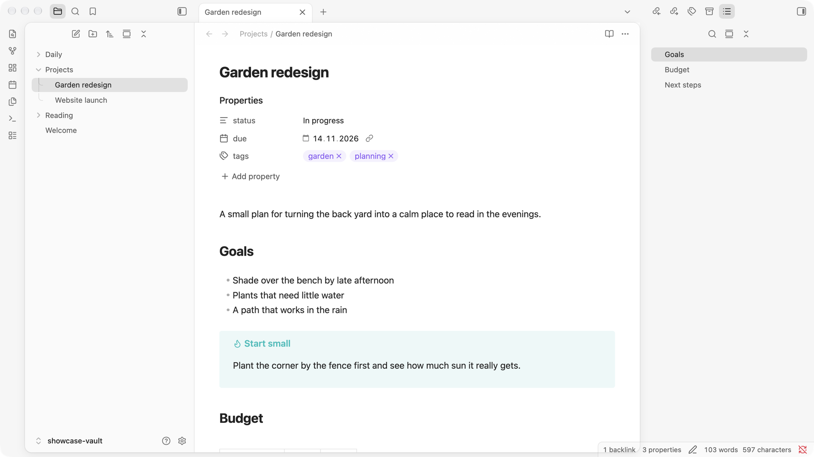
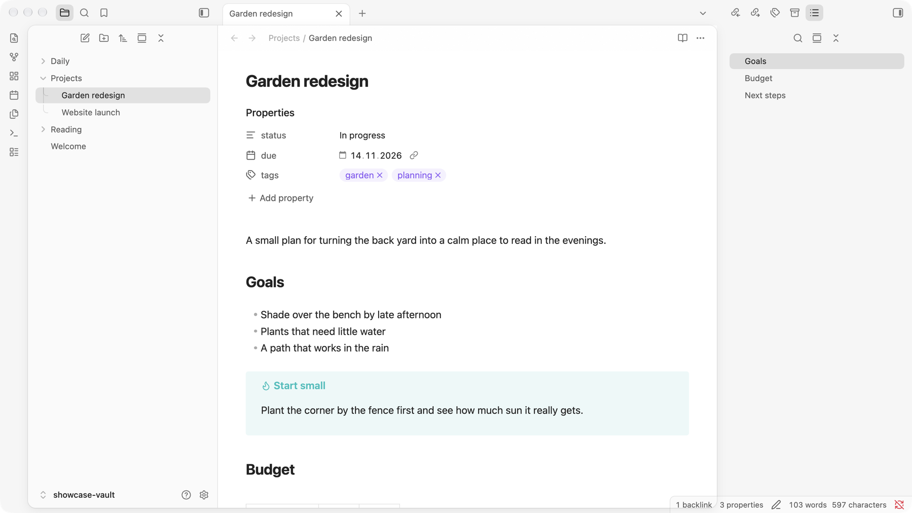

# Inlay

An Obsidian theme where the workspace is a single card **inlaid** in a neutral shell.





- The editor and the left sidebar sit on one floating card with a soft shadow.
- The ribbon, title bar and right sidebar rest on the shell around it.
- File explorer guides curve into each row.
- Optional **glass**: a translucent shell over the OS blur and a frosted note header that text scrolls beneath.

Inlay deliberately changes only colour, surfaces, layout and shape. Every dimension, all typography and the rendering of your notes (editor, reading view, properties) stay exactly as in Obsidian's default theme. The colour palette is Obsidian's own, in both light and dark mode.

## Settings

Install [Style Settings](https://github.com/mgmeyers/obsidian-style-settings) to configure Inlay:

| Section | Options |
| --- | --- |
| Colours | Accent (theme or app accent), shell, card, left sidebar |
| Layout | Flat mode, card gap, card radius, card shadow |
| Tabs & sidebars | Close button on hover, curved/straight tree guides, auto-hide explorer buttons |
| Translucent window | Shell opacity, frost amount and colour, grain, card and sidebar opacity |
| Glass note header | Opacity, blur, saturation |

The translucent window needs **Settings → Appearance → Translucent window** (macOS / Windows). The blur behind the window comes from the operating system and can't be tuned by a theme. The note header's blur is in-app and fully adjustable.

## Install manually

Copy `manifest.json` and `theme.css` into `<vault>/.obsidian/themes/Inlay/`, then pick **Inlay** in **Settings → Appearance → Themes**.

## Development

```bash
npm install
npm run lint
```

To try changes in your vaults, list their paths (one per line) in `vaults.local.txt` and run:

```bash
npm run sync
```

This copies `manifest.json` and `theme.css` into each vault and into `showcase-vault/`. Obsidian doesn't pick up edits made through symlinks, so vaults get real copies.

### Releasing

1. Bump `version` in `package.json` and run `npm run version`. This updates `manifest.json` and `versions.json`.
2. Commit, then push a tag that matches the version, for example `git tag 0.2.0 && git push --tags`.
3. The release workflow creates a draft GitHub release with `manifest.json` and `theme.css`.

`screenshots/screenshot.png` (512×288) is the community directory thumbnail. To retake screenshots, open `showcase-vault/` as a vault. Run `npm run sync` first so it has the current theme.

## License

[MIT](LICENSE)
